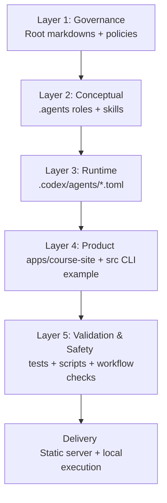
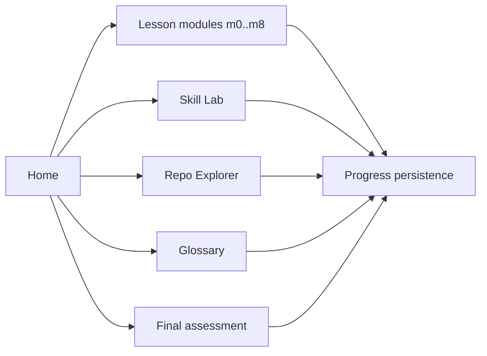
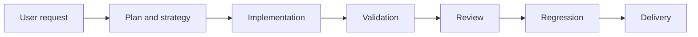

# Repository Architecture Blueprint

## Purpose

This document defines the complete architecture of this repository as a layered system.
It is the technical reference for understanding how governance, conceptual design, runtime execution, product implementation, and validation fit together.

## Architecture at a glance

## Layer 1 — Governance (Root)

### Main files
- `AGENTS.md` (source of truth)
- `AI_WORKFLOW.md`
- `SYSTEM_OVERVIEW.md`
- `SECURITY.md`
- `AGENTS_CHANGELOG.md`
- `README.md`

### Responsibility
- Define operating model, decision hierarchy, and safety constraints.
- Resolve conflicts between instructions.
- Preserve traceability and evolution history.

### Key rule
If there is conflict, `AGENTS.md` has priority.

---

## Layer 2 — Conceptual Design (`.agents`)

### Main files
- `.agents/*.agent.md`
- `.agents/AGENT_MAPPING.md`
- `.agents/skills/*/SKILL.md`

### Responsibility
- Define the conceptual behavior of each role:
  - planner
  - qa-strategy
  - dev
  - qa-functional / qa-api
  - reviewer
  - qa-regression
  - meta / security
- Provide reusable protocols via skills (`00`, `10`, `20`, `30`, `40`).

### Output of this layer
A clear model of responsibilities and phase ordering.

---

## Layer 3 — Runtime Execution (`.codex`)

### Main files
- `.codex/agents/planner.toml`
- `.codex/agents/workflow.toml`
- `.codex/agents/builder.toml`
- `.codex/agents/qa.toml`
- `.codex/agents/reviewer.toml`
- `.codex/agents/meta.toml`
- `.codex/agents/security.toml`

### Responsibility
- Materialize conceptual roles into executable runtime configuration.
- Keep runtime behavior aligned with conceptual intent.

### Mapping note
- `dev` (conceptual) maps to `builder` (runtime).
- `qa-*` conceptual roles map to `qa` runtime aggregation.
- `workflow` and `meta` are first-class runtime roles.

---

## Layer 4 — Product Implementation

### A) Course application (`apps/course-site`)

#### Sub-layers
1. Presentation
   - `apps/course-site/public/*.html`
   - `apps/course-site/public/styles.css`
2. Client logic
   - `apps/course-site/public/*.js`
3. Content model
   - `apps/course-site/content/*.json` (ES/EN)
4. Delivery
   - `apps/course-site/server.js` (static server)

#### Responsibility
- Provide the educational experience for learning AI agents + skills workflow.
- Keep content and UI language-synchronized (`es` / `en`).
- Track local progress (modules, quizzes, knowledge hub resources).

### B) CLI sample (`src`)

#### Files
- `src/cli.js`
- `src/expenseService.js`

#### Responsibility
- Demonstrate a simple Node CLI use case (expense tracker).
- Serve as independent example workload, separate from course UI.

---

## Layer 5 — Validation and Safety

### Automated tests
- `tests/course/*` → course structure, content, i18n, shell integrity
- `tests/unit/*` → CLI expense service logic
- `tests/test_skills_idempotence.py` → mandatory architecture file manifest
- `tests/legacy/*` → archived reference specs (explicitly out of active default suite)

### Safety controls
- `scripts/pre-checks.sh`
- `scripts/post-report.sh`
- `.github/workflows/agent-safety.yml`

### Responsibility
- Validate behavior and structural consistency.
- Detect dangerous patterns and enforce guardrails.

---

## Cross-cutting flows

## 1) Learning flow (course)

## 2) Architecture governance flow

---

## Design decisions

1. **Layered architecture** to separate policy, design intent, runtime config, product, and validation.
2. **Bilingual content model** to keep educational parity (`es` and `en`).
3. **Static-first delivery** for low operational complexity.
4. **Local progress persistence** for a frictionless no-login learning experience.
5. **Quality gates as architecture concern**, not optional add-ons.

---

## Risks and mitigations

1. **Scope mixing (template + course + CLI)**
   - Mitigation: explicit documentation boundaries and test ownership per area.
2. **Stale bilingual parity**
   - Mitigation: i18n consistency tests.
3. **Runtime-config drift vs conceptual docs**
   - Mitigation: keep `AGENT_MAPPING.md` and changelog updated for structural changes.

---

## Evolution roadmap

1. Add explicit architecture decision records (ADR folder).
2. Add architecture-specific smoke tests for main course routes.
3. Keep legacy/non-course specs isolated and documented under `tests/legacy`.
4. Introduce architecture version tag in changelog entries.

---

## Definition of architecture done

- Architecture documented in repository (`REPO_ARCHITECTURE.md`).
- Architecture visible inside course home page.
- Conceptual/runtime/product/test layers explicitly mapped.
- Flows and risks documented with actionable guidance.
